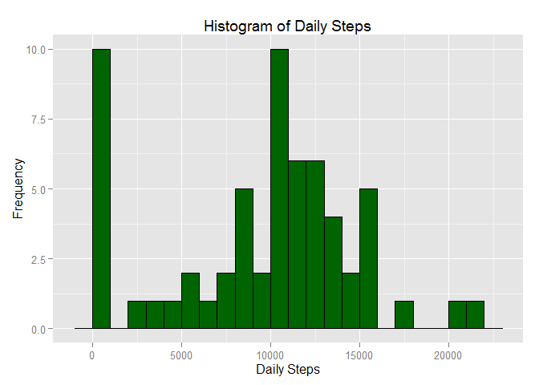
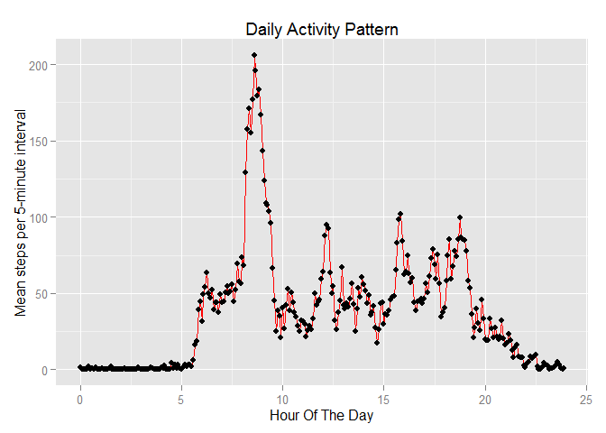
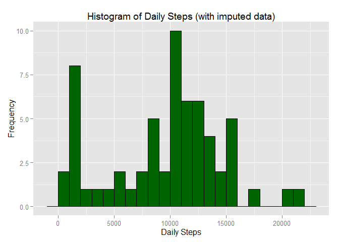
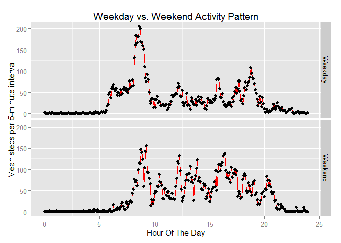

# Reproducible Research: Peer Assessment 1
John Bejarano  
This purpose of this assignment is to analyze step data from a personal activity monitor, find some descriptive statistics and patterns to this step data, and present it in a comprehensive R Markdown file.  The data was captured by an individual that collected data throughout October and November, 2012.

## Loading and preprocessing the data

Before we can analyze the data in R, it must be read in from the provided CSV file.


```r
setwd("H:\\Data Science\\RepData_PeerAssessment1\\RepData_PeerAssessment1")
stepdata <- read.csv("activity\\activity.csv")
```

First, we'll convert the dates to an actual datetime data type.  Then, we'll deal with the time of day.  This data is organized in five-minute intervals.  That is, each five minutes, there is one row of data indicating the number of steps taken over the previous five minutes.  The date is kept the "date" column, and the time of day is kept in the "interval" column.  

However, the time of day is stored as an integer of the form, *hhmm*, with no leading zeroes.  Thus 12:05am is stored as 5, while 2:30pm is stored as 1430.  This presents a hazard.  If we treat these integer values for the time of day as is, then when plotting, all of the intervals between fifty-five minutes past the hour, and the top of the hour will appear to be 45 minutes long relative to all of the other five minute intervals.  These timestamps will need to be processed to make them more useful in the analysis.


```r
library(stringr)
library(lubridate)
stepdata$date <- ymd(stepdata$date)
stepdata$time <- with(stepdata, paste(str_pad(floor(interval/100), 2, pad = "0"),
                                      str_pad(interval %% 100, 2, pad = "0"),
                                      sep = ":"))
stepdata$hour <- with(stepdata, floor(interval/100) + (interval %% 100) / 60)
```

Now, the time interval, stored in a new column called "time", is in a more human-readable format (though still using 24-hour time).  Plus, we have a continuous numeric variable called "hour" that indicates the number of hours so far in the day.  This can be useful for plotting purposes.

## What is the mean total number of steps taken per day?

First, let's see what our step data looks like on a daily basis.  Note, that we will treat intervals with missing data as though they had zero steps.


```r
library(ggplot2)
dailysteps <- tapply(stepdata$steps, stepdata$date, sum, na.rm = TRUE)
g1 <- ggplot(NULL, aes(x = dailysteps))
g1 <- g1 + geom_histogram(binwidth = 1000, fill = "darkgreen", color = "black")
g1 <- g1 + labs(x = "Daily Steps",
                y = "Frequency",
                title = "Histogram of Daily Steps")
print(g1)
```

 

Aside from a number of zero-step or very-low-step days (likely due to missing data), modally, our subject usually walks a bit over 10,000 steps per day.  As 10,000 steps is often a stated goal in many exercise programs and fitness literature, this may not be a random effect.

Let's have a look at the mean and median steps taken per day by this individual.


```r
mean(dailysteps)
```

```
## [1] 9354.23
```

```r
median(dailysteps)
```

```
## [1] 10395
```

The median is definitely higher than the mean in this case.  Since some missing data is dragging down the total steps in a number of days in our observation range, the mean is artificially being dragged down with it.  Thus, the median is probably more emblematic of a *typical* day's worth of steps for this individual.  The look of the histogram, when ignoring the left-most bin of zero-step or very-low-step days, bears this out.

## What is the average daily activity pattern?

Next, let's look at the average daily activity pattern with respect to the time of day.  For this analysis, I'll be using the **dplyr** package to summarize data.


```r
library(dplyr)
```

```
## 
## Attaching package: 'dplyr'
## 
## The following objects are masked from 'package:lubridate':
## 
##     intersect, setdiff, union
## 
## The following object is masked from 'package:stats':
## 
##     filter
## 
## The following objects are masked from 'package:base':
## 
##     intersect, setdiff, setequal, union
```

```r
dailypatterndata <- stepdata %>%
     select(hour, steps) %>%
     group_by(hour) %>%
     summarize(
          meansteps = mean(steps, na.rm = TRUE),
          mediansteps = median(steps, na.rm = TRUE)
          )
g2 <- ggplot(dailypatterndata, aes(x = hour, y = meansteps))
g2 <- g2 + geom_line(colour = "red") + geom_point()
g2 <- g2 + labs(x = "Hour Of The Day",
                y = "Mean steps per 5-minute interval",
                title = "Daily Activity Pattern")
print(g2)
```

 

Note, that I am computing both mean number steps for each five-minute interval which are shown in the plot, and also the median number of steps for each five-minute interval that I will use to impute values for missing data below.

The data indicate that the most active time in this individual's day (based on the mean number of steps during each five-minute interval) is mid-morning from about 8:00am until about 9:30am.  This may be this individual's designated workout time, or there may be a day or two where there was an unusually large amount of activity at this time thus causing the mean to spike.  There are other lesser but still notable peaks around mid-day, late afternoon, and evening time, potentially indicating activity around lunchtime, an evening commute, and dinnertime.  The causes of these spikes are just speculation, but the data does recommend further inquiry into the individual's activity at these times.

## Imputing missing values

While it's interesting to see results when ignoring missing values.  The effects of those missing values can be non-trivial.  Let's examine how large an issue this is within this data set.


```r
sum(is.na(stepdata$steps))
```

```
## [1] 2304
```

```r
mean(is.na(stepdata$steps))
```

```
## [1] 0.1311475
```

As you can see, we have over 2300 five-minute intervals over the entire two month study where we have no data.  That is over 13% of our population with no valid value.

In the last section, I computed the median number of steps for each five-minute interval throughout the day.  For any missing data, let's use the median number of steps for that missing data's five-minute interval.  Then we'll plot the same histogram we did for the non-imputed data above, and calculate the new mean and median to see what has changed.


```r
impstepdata <- merge(stepdata, dailypatterndata, by = "hour")
improws <- which(is.na(impstepdata$steps))
impstepdata$steps[improws] <- impstepdata$mediansteps[improws]
impdailysteps <- tapply(impstepdata$steps, impstepdata$date, sum)
g3 <- ggplot(NULL, aes(x = impdailysteps))
g3 <- g3 + geom_histogram(binwidth = 1000, fill = "darkgreen", color = "black")
g3 <- g3 + labs(x = "Daily Steps",
                y = "Frequency",
                title = "Histogram of Daily Steps (with imputed data)")
print(g3)
```

 

If you compare the two histograms, you'll see that a number of days that were listed as zero have been moved to the right in the new histogram with imputed data.  As these missing datapoints were originally assumed to be zero, but now have positive numbers imputed from the medians of their respective five-minute intervals, we would expect that if there were any change, the total number of steps would increase.  This is evident in the histogram.


```r
mean(dailysteps); mean(impdailysteps)
```

```
## [1] 9354.23
```

```
## [1] 9503.869
```

```r
median(dailysteps); median(impdailysteps)
```

```
## [1] 10395
```

```
## [1] 10395
```

This effect is also evident in the increase to the mean daily number of steps.  However, we see that the median is unchanged.  Since the median is unchanged, and this imputation would only affect datapoints that were zero and make them positive, we can infer that the affected days were all days where the total number of steps was below the original median.  The histogram also seems to indicate that this is true.

## Are there differences in activity patterns between weekdays and weekends?

For the final bit of analysis, we'd like to take our imputed data set from the last section and see if we can detect a difference in the daily activity pattern between weekdays and weekends.  We'll add factor variables to indicate which type of day we're looking at, and then perform a similar type of analysis to our daily activity pattern analysis above.


```r
impstepdata$dayofweek <- weekdays(impstepdata$date)
impstepdata$daytype <- rep("Weekday", nrow(impstepdata))
weekendrows <- which(impstepdata$dayofweek %in% c("Saturday", "Sunday"))
impstepdata$daytype[weekendrows] <- "Weekend"

weekdaypatterndata <- impstepdata %>%
     select(daytype, hour, steps) %>%
     group_by(daytype, hour) %>%
     summarize(
          meansteps = mean(steps),
          mediansteps = median(steps)
          )
g4 <- ggplot(weekdaypatterndata, aes(x = hour, y = meansteps))
g4 <- g4 + geom_line(colour = "red") + geom_point()
g4 <- g4 + facet_grid(daytype ~ .)
g4 <- g4 + labs(x = "Hour Of The Day",
                y = "Mean steps per 5-minute interval",
                title = "Weekday vs. Weekend Activity Pattern")
print(g4)
```

 

Now that we've split the activity between weekdays and weekends, we see that the original pattern with a large spike in the morning, and three additional spikes at mid-day, late afternoon, and in the evening is more prominent during weekdays.  The pattern is far less coherent during weekends.

This indicates that this individual's activity occurs at more predictible times on weekdays, and is not necessarily as predictible on weekends.  The reason these patterns show up on the original analysis is that the five days of coherent patterns will tend to dominate only two days of less coherent patterns.

Also, note that the large spike is still shown on weekdays, but is muted on weekends.  Before we split the data this way, we weren't really sure if this was due to an active morning commute (say by walking or bicycling), or if it was due to a major workout maybe done during the weekends.  While we still cannot say for sure, this analysis seems to favor the morning commute hypothesis.
